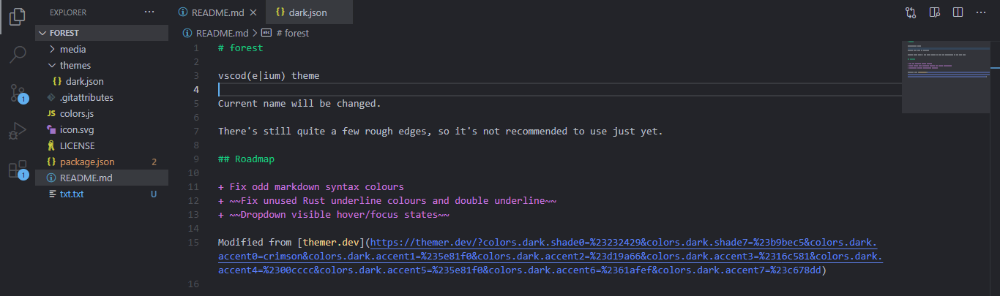
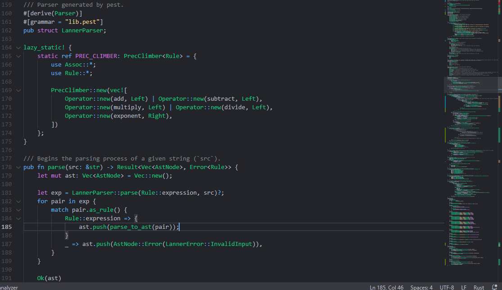
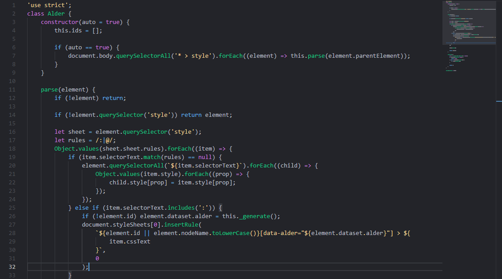
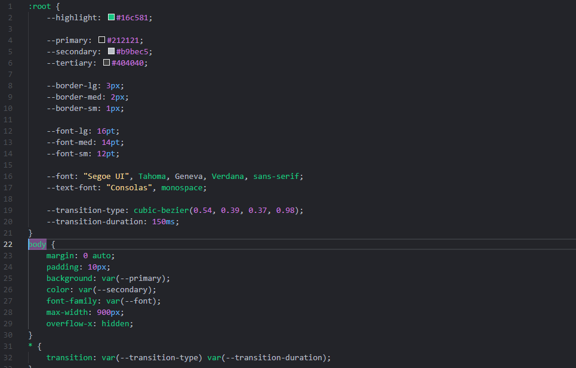
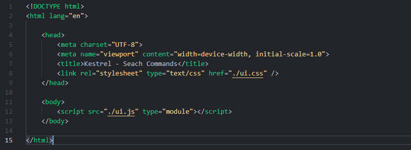

# forest

vscod(e|ium) theme

Current name will be changed.

There's still quite a few rough edges, so it's not recommended to use just yet.

## Roadmap

+ Fix odd markdown syntax colours
+ ~~Fix unused Rust underline colours and double underline~~
+ Dropdown visible hover/focus states (files in file explorer, etc.)

## Images

Rust:

JavaScript:

CSS:

HTML:

Modified from [themer.dev](https://themer.dev/?colors.dark.shade0=%23232429&colors.dark.shade7=%23b9bec5&colors.dark.accent0=crimson&colors.dark.accent1=%235e81f0&colors.dark.accent2=%23d19a66&colors.dark.accent3=%2316c581&colors.dark.accent4=%2300cccc&colors.dark.accent5=%235e81f0&colors.dark.accent6=%2361afef&colors.dark.accent7=%23c678dd)
